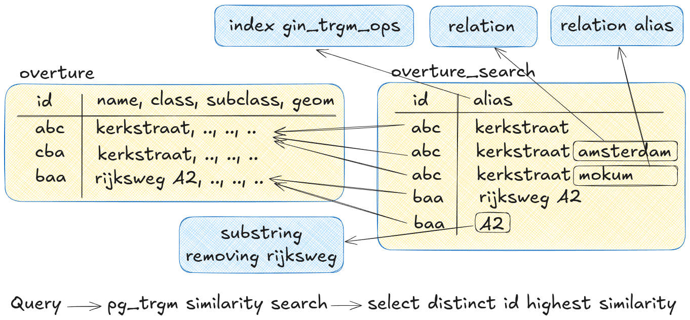

# geocodeur

This project explores the creation of a geocoder using Overture Maps data with free-text search functionality, leveraging similarity search based on trigram matching. The goal is not to replicate the original Overture data but to design a simplified schema focused solely on geocoding needs, avoiding unnecessary data that does not serve this purpose.

The geocoder will include the following data categories:

- Division
- Road
- POI (Point of Interest)
- Water
- Infrastructure

To improve search precision, multiple aliases can be generated for each Overture Maps feature. These aliases anticipate user input that may combine multiple locations to refine search results. For example, in the Netherlands, many streets are named "Kerkstraat." If a user searches for "Kerkstraat Amsterdam," the geocoder should prioritize "Kerkstraat" in Amsterdam as the top result. To achieve this, aliases like "Kerkstraat," "Kerkstraat {intersecting division.locality}," and "Kerkstraat {intersecting division.county}" are added. These aliases vary based on the class and subclass of the feature.

Trigram matching allows for flexible searches. For instance, even if a user types "Kerkstr Amsterd," the geocoder can still locate "Kerkstraat" in Amsterdam.

Additionally, related road segments are merged into a single entry, enabling retrieval of the full road rather than fragmented segments. This approach reduces the likelihood of excessive high-matching results for the same road.

Other cases can also be accommodated. For instance:

A user searching for "A2" (a highway in the Netherlands) can find the correct result even though its name in Overture is "Rijksweg A2," thanks to aliases like "A2" and "Rijksweg A2."
For entries with names like "'s-Hertogenbosch," a common alias "den bosch" can be added, as users are more likely to type the latter. These aliases are applied to all related entries and relationships.


## Vectors?

A test was also done with creating vectors for the aliases instead of trigram matching but since the input will not benefit much from semantics we can stick with trigram matching. Some other cons of vectors vs trigram matching for the geocoder:

- Much more computation time to create the database
- Much more storage space needed for the vectors, With a small test dataset 96MB vs 11MB
- Cannot handle typos as well as trigram matching.
- Does not handle swappable words as well as trigram matching.

The performance looks roughly the same for both methods.

## ToDo

This is a first test and by no means a usable thing.

- Add water and infrastructure data
- Add API service
- Reverse geocoding
- Add more aliases
- Filter based on bbox, class, subclass
- Tool to take away installing deps, manual downloading and processing data

## Getting started

### Download & prepare data

To download data we can use the overturemaps CLI tool and to process the data we use DuckDB. To install the CLI tool we can use pip.

```sh
pip install overturemaps
```

To install DuckDB we can use the following commands.

```sh
curl --fail --location --progress-bar --output duckdb_cli-linux-amd64.zip https://github.com/duckdb/duckdb/releases/download/v1.1.3/duckdb_cli-linux-amd64.zip && unzip duckdb_cli-linux-amd64.zip
```

Now we can download all data from Overture Maps with a given bounding box using the `download` script. The script will download all data in the bounding box and store it in the `data/download` directory.

```sh
./scripts/download.sh 5.117491,51.598439,5.579449,51.821835
```

We can now process the data to mold it into something we can use.

```sh
./scripts/process.sh
```

### Load data into the database

Start a local PostGIS database

```sh
docker compose up -d
```

Create the tables and load data

```sh
go run main.go create
```

Test a query

```sh
go run main.go query "Adr poorters Vught"

ID: 0871fa4b6affffff046ff9a382713452, Name: Adriaan Poortersstraat, Class: road, Subclass: residential, alias: Adriaan Poortersstraat Vught, Similarity: 0.548387
ID: 0881fa4b6e7fffff047fefca39722950, Name: Poortlaan, Class: road, Subclass: residential, alias: Poortlaan Vught, Similarity: 0.458333
ID: 0850345cbfffffff01ce7b770cbcd605, Name: Vughterpoort, Class: division, Subclass: neighborhood, alias: Vughterpoort Vught, Similarity: 0.434783
ID: 0881fa4b463fffff047f67c7ffb17b1b, Name: Poirtersstraat, Class: road, Subclass: residential, alias: Poirtersstraat Vught, Similarity: 0.379310
ID: 0861fa4b6fffffff046ffd18b6fe4bf4, Name: Postweg, Class: road, Subclass: unknown, alias: Postweg Vught, Similarity: 0.320000
ID: 0891fa4b6a9bffff046fffbd97b71b83, Name: Postweg, Class: road, Subclass: tertiary, alias: Postweg Vught, Similarity: 0.320000
ID: 08c1fa4b42b231ff047eff1228c9428a, Name: De Voort, Class: road, Subclass: track, alias: De Voort Vught, Similarity: 0.320000
ID: 08b1fa4b6a9b4fff046fefb783b1e7d7, Name: Postweg, Class: road, Subclass: cycleway, alias: Postweg Vught, Similarity: 0.320000
ID: 08f1fa4b6a04d3890322fa112c36e1fe, Name: Vught, Class: poi, Subclass: , alias: Vught Vught, Similarity: 0.315789
ID: 085036a4ffffffff01d4415f1a3b6d42, Name: Vught, Class: division, Subclass: county, alias: Vught, Similarity: 0.315789
```

## Data

### Database

The database consists of 2 tables: `overture` and `overture_search`. The `overture` table contains the features from Overture Maps and the `overture_search` table contains aliases for the features which point to the `overture` table. The column `alias` in the `overture_search` table has a `gin_trgm_ops` index on it for fast searching using the PostgreSQL extension `pg_trgm`.



### Division

- Add locality for neighbourhoods features
- Add county for locality features

### Road

- Only segments with a primary name, we cannot search for a segment without a name so leave them out.
- Only segments with a subtype road. Tracks are not usefull for geocoding and water we will get from a different source since water features are segments and not water bodies.
- Roads are split up in multiple segments merge them by name, class (overture) and connecting lines
- Add relations for locality and county to roads but exlude realtions for motorways since this does not make much sense.

### POI

- Take all pois and do not filter on confidence for now
- Add relations for locality to the pois
