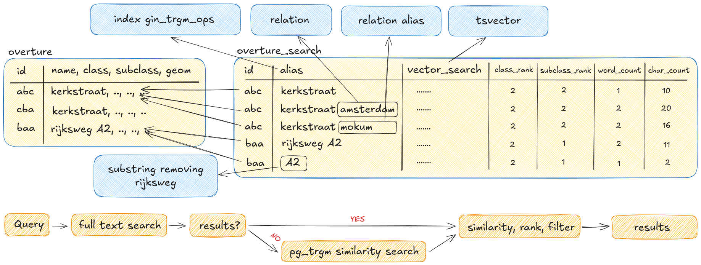

# geocodeur

This project explores the creation of a geocoder using Overture Maps data with free-text search functionality, leveraging FTS and similarity search based on trigram matching. The goal is not to replicate the original Overture data but to design a simplified schema focused solely on geocoding needs, avoiding unnecessary data that does not serve this purpose.

The geocoder includes the following data categories:

- Division
- Road
- POI
- Water
- Infra
- Address
- Zipcode

To improve search precision, multiple aliases can be generated for each Overture Maps feature. These aliases anticipate user input that may combine multiple locations to refine search results. For example, in the Netherlands, many streets are named "Kerkstraat." If a user searches for "Kerkstraat Amsterdam," the geocoder should prioritize "Kerkstraat" in Amsterdam as the top result. To achieve this, aliases like "Kerkstraat" and "Kerkstraat {intersecting division.locality}" are added. These aliases vary based on the class and subclass of the feature.

Postgres Full Text Search (FTS) is used to index the aliases and can handle most of the queries efficiently. For instance if a user types "Kerkstr Amsterd," the geocoder can still locate "Kerkstraat" in Amsterdam. When FTS is not able to find a match for example in case of a typo, trigram matching takes over to find similar results.

Additionally, related segments for road, water and infra are merged into a single entry, enabling retrieval of the full feature rather than fragmented segments in the Overture Maps data. This approach reduces the likelihood of excessive high-matching results for the same road or water.

Other cases can also be accommodated. For instance:

A user searching for "A2" (a highway in the Netherlands) can find the correct result even though its name in Overture is "Rijksweg A2," thanks to aliases like "A2" and "Rijksweg A2."
For entries with names like "'s-Hertogenbosch," a common alias "den bosch" can be added, as users are more likely to type the latter. These aliases are applied to all related entries and relationships.

## ToDo

This is a first experiment and seems to work pretty good but there are still some todo's.

- Make aliases configurable trough config
- API: Endpoint for reverse geocoding
- API: Filter results based on bbox
- API: Batch geocoding
- Data: Store original overture id's in the overture table
- Data: Some problems and todo's described below
- CLI: Better cli with help and commands and making it easier to setup geocodeur

## Getting started

### Download

To download data we can use the overturemaps CLI tool and to process the data we use DuckDB. To install the CLI tool we can use pip.

```sh
pip install overturemaps
```

Now we can download all data from Overture Maps with a given bounding box using the `download` script. The script will download all data in the bounding box and store it in the `data/download` directory.

```sh
# Test set 1
./scripts/download.sh 5.117491,51.598439,5.579449,51.821835

# Test set 2 (1/6th of the Netherlands)
./scripts/download.sh 4.60788273,51.5727799,6.12797006,52.1129134

# Test set 3 (Netherlands and big part of Belgium and small patch of Germany)
./scripts/download.sh 3.1624817624420167,50.76012028429577,7.274625587715649,53.50694358074323
```

### Process data

We can now process the downloaded Overture Maps data to make it usable for geocodeur, this can take some time when processing a big area.

```sh
go run main.go process
```

### Load data into the database

Start a local PostGIS database or bring your own.

```sh
docker compose up -d
```

Create the tables and load data

```sh
go run main.go create
```

### Start server

When data is loaded in the database we can start the API server and fire some queries.

```sh
go run main.go server
```

#### Docs

OpenAPI docs available at [http://localhost:8080/docs](http://localhost:8080/docs)

#### Query API

```sh
curl -X GET "http://localhost:8080/geocode?q=Adr%20poorters%20Vught&class=road&geom=true&limit=10"
```

FTS has a 1 result so no fallback to trigram matching is needed.

```json
{
    "queryTime": 6,
    "results": [
        {
            "id": 339468,
            "name": "Adriaan Poortersstraat",
            "class": "road",
            "subclass": "residential",
            "divisions": "{Vught}",
            "alias": "adriaan poortersstraat vught",
            "searchType": "fts",
            "similarity": 0.548,
            "geom": {
                "type": "LineString",
                "coordinates": [
                    [
                        5.2859974,
                        51.6466151
                    ],
                    [
                        5.2860828,
                        51.646718
                    ],
                    [
                        5.2891755,
                        51.6474486
                    ]
                ]
            }
        }
    ]
}
```

## Data

### Database

The database consists of 2 tables: `overture` and `overture_search`. The `overture` table contains the features from Overture Maps and the `overture_search` table contains aliases for the features which point to the `overture` table. The column `alias` in the `overture_search` table has a `gin_trgm_ops` index on it for searching using the PostgreSQL extension `pg_trgm`. A column `vector_search` is added to the `overture_search` table which contains a tsvector of the aliases and is used for full text search. The rest of the colums: `class_rank`, `subclass_rank`, `word_count` and `char_count` are used for filtering and ranking the results.



### Division

#### Process

- Adds locality relations for neighbourhoods & microhood features
- Adds county relations for locality features
- Adds region relations for county features

### Road

#### Process

- Only picks segments with a primary name, we cannot search for a segment without a name so we leave them out.
- Only picks segments with a subtype road. Tracks are not usefull for geocoding and water we will get from a different source since water features are segments and not water bodies.
- Merges clusterable segments into 1 feature
- Adds relations for locality to roads but exlude relations for motorways since this does not make much sense.

#### ToDo

- Motorways are a big mess, inconsistent naming and alot of segments without a name
- Subtypes are not always that good, for instance we have a residential road with a road that should connect to it with the same name but the segment is unclassified resulting in 2 roads separate roads.
- Sometimes roads are grouped but there is another road in between, should this be 1 road or 2 roads?

### Water

#### Process

- Only picks features with primary name
- Selects overture subtype as subclass
- Merges clusterable features into 1 feature (works for polygons and lines)

#### ToDo

- We have features 'duplicated' as lines and polygons, remove a line if it's within a polygon with the same name and subclass

### POI

#### Process

- Takes all pois with confidence 0.4 or higher
- Adds locality relation to features

### Address

#### Process

- Combines street and number for name/alias
- Picks address_levels for relations

### Zipcode

These are not official zipcode areas but are generated based on zipcodes from the address data.

#### Process

- Groups addresses by zipcode and union geometries and create convex hull as zipcode area

#### ToDo

- Fill the country with the zipcode areas, can we somehow create a voronoi with the polygons we have?

### Infra

#### Process

- Takes only infra features with a name and filters out some classes that are not usefull for geocoding
- Merges close infra features with same name and class
- Adds locality relation to features

## Building executable

Manually build the geocodeur executable with the following command.

```sh
go build -ldflags="-s -w" -gcflags="-m" -o geocodeur ./src/main.go
```

## Docker

Run geocodeur server and mount a config file, we use `--network host` so geocodeur can connect directly to the database.
Latest image is available on ghcr.io.

```sh
docker run --network host -v ./config/geocodeur.conf:/config/geocodeur.conf ghcr.io/tebben/geocodeur:latest
```

## Tests

### pg_trgm

pg_trgm can be very fast but the performance tanks when there are a lot of aliases in the database containing the same word. For instance searching for `Amsterdam` results in 620.000 features, when ordering by similarity the query takes multiple seconds while we are looking for sub 100ms response times. pg_trgm is however very helpfull when there are typing errors so in the current setup pg_trgm is only used as a fallback when FTS does not return any results.

### Meilisearch

Performance is great but adds another service to the stack. With some effort of trying to rank the results I got some ok responses but still got some unexpected results for some inputs. Overall a great tool but maybe not the best for our use case.

### Bluge/bleve

I tried to have a more integrated solution with Bluge/bleve, played around alot to get the best results which were ok in the end but the performance was not satisfying enough.

### Typesense

Not able to get expected results.

### ToDo

Would be fun to explore a custom solution in Go using BK-tree, trigrams and inverted indexes to see if we can get good results and fast response times directly in Geocodeur.
